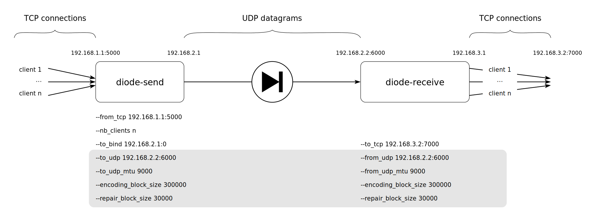

.. _Command line parameters:

Command line parameters
=======================

When running `diode-send` and `diode-receive` with cargo, command line parameters must appear after after double-hyphen separator. For example, to display all available options for the sender part:

.. code-block::

   $ cargo run --release --bin diode-send -- --help

Overview
--------

Here is a diagram of the components involved in an example usage of lidi, annotated with command line parameters:

.. note::
   Parameters that are displayed in the gray box must be the same of both sides (sender and receiver) of lidi.

Following, we provide some details about each command line options.

Adresses and ports
------------------

As shown in the :ref:`Getting started` chapter, default values work well for testing the diode on a single machine. But for real application, ip addresses and ports must be configured properly. There are three points in the diode chain where those settings should be provided.

TCP data source
"""""""""""""""

The diode-send side gets data from TCP connections. It is necessary to specify ip address and port in which TCP connections will be accepted with the following parameter:

.. code-block::

   --from_tcp <ip:port>

Default value is 127.0.0.1:5000.

TCP data destination
""""""""""""""""""""

On the diode-receive side, data will be sent to TCP connected clients. To specify listening ip and TCP port:

.. code-block::

   --to_tcp <ip:port>

Unix data source
""""""""""""""""

The diode-send side gets data from Unix connections. It is necessary to specify ip address and port in which Unix connections will be accepted with the following parameter:

.. code-block::

   --from_unix <path>

Unix data destination
"""""""""""""""""""""

On the diode-receive side, data will be sent to Unix connected clients. To specify listening Unix socket path:

.. code-block::

   --to_unix <path>

UDP transfer
""""""""""""

UDP transfer is the core of the diode. Settings ip addresses and port is necessary. On the sender side:

.. code-block::

   --to_udp <ip:port>

describe where to send data and is defaulted to 127.0.0.1:6000, and socket is bound to address and port according to:
  
.. code-block::

   --to_bind <ip:port>

which is defaulted to 0.0.0.0:0. This default value should work in many cases.

On the receiver side, the option:

.. code-block::

   --from_udp <ip:port>

defines ip and port to listen for incoming UDP packets, and should be set to the same value as `--to-udp`.

Optionally, you can set the size of the UDP socket buffers with following option:

.. code-block::

   --udp_buffer_size <nb_bytes>

This option is available on both sides. Default value is 1073741824 which is the highest possible value.
The specified size is then doubled by the kernel (see https://man7.org/linux/man-pages/man7/socket.7.html).

Block and packet sizes
----------------------

To be transferred through the diode, data is sliced by lidi at different levels:

 - into `blocks` at the logical fountain codes level,
 - into `packets` at the UDP transfer level.

One can have effect on the slicing sizes to achieve optimal performances by using several command line options.
Firstly, MTU can be set on both diodes side, and should be set to the same values:

.. code-block::

   --to_udp_mtu <nb_bytes>
     on the sender side

.. code-block::

   --from_udp_mtu <nb_bytes>
     on the receiver side

Default MTU values are set to 1500 and can be increased when network devices allow for higher values.

Then, on the logical level, fountain codes operates on blocks. If blocks reordering produces errors, they can be increased too. Repair blocks represent redundancy and are used by fountain codes to ensure data reconstruction. On both sides, parameters have the same name and must be set to the same values:

.. code-block::

   --encoding_block_size <nb_bytes>
  
   --repair_block_size <ratior>

The default value for an encoding block is 60000, and repair block size is defaulted to 10% of this value (6000).
See the :ref:`Tweaking parameters` chapter for more details on how to choose optimal values for your particular use case and devices.

Multiplexing
------------

Lidi can handle several transfers in parallel, so that big data transfer doesn't prevent other data chunks to be handled. The number of transfers in parallel is adapted by lidi according to the number of TCP clients that can be connected simultaneously.It can be configured on both sides with the option: 

.. code-block::

   --nb_clients <nb>

which has its default value set to 2.

Although not strictly required nor enforced by lidi, the number of TCP clients on sender side and on receiver side will be equals in mosts use cases for better results.

Multithreading
--------------

To ensure data integrity through the UDP link, Lidi uses RaptorQ fountain codes. This means that logical block of data need to be encoded (sender side) and then decoded (receiver side). Several threads can be spawned to parallelized such computations, with the following options:

.. code-block::

   --nb_encoding_threads <nb>
     (sender side, default: 2)

   --nb_decoding_threads <nb>
     (receiver side, default: 1).

Timeouts
--------

Since lidi uses UDP protocol to transfer data, blocks and datagrams can be reordered.
Fountain codes are used to ensure data integrity despite possible transfer reordering and losses. Also, it can be harder for the receiving part to know that a particular transfer is done, since an EOF-like marker can be received before the end of the data, or simply lost.
Thus, a configurable timeout is used in lidi to decide when to reset fountain code status:

.. code-block::

   --flush_timeout <nb_milliseconds>
     (receiver side, default: 500)

Heartbeat
---------

Since the purpose of the diode is to only allow one-way data traffic, the sender cannot be aware if a receiver is set up or not. But heartbeat messages are regularly sent through the diode so that the receiver can be aware of a sender disconnection. Heartbeat times can be set with the following option on both sides:

.. code-block::

   --heartbeat <nb_secs>

The default values are 5 seconds for the sender (i.e. a heartbeat message is sent every 5 seconds) and 10 seconds for the receiver (i.e. warnings are displayed whenever during 10 seconds no heartbeat message was received). Due to latency, timeouts and network load, the receiver value must always be greater than the sender value.
